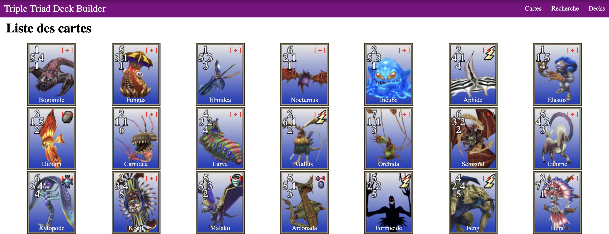

# Challenge Deck Builder

Ce projet est un challenge que j'ai effectué pendant ma [formation O'Clock](https://oclock.io/formations/developpeur-web-fullstack-javascript), durant la quatrième "saison".\
Il s'agissait de développer une application web pour gérer et rechercher des cartes, avec **EJS**, **Express.js**, et **PostgreSQL**.



## Technologies

- HTML
- CSS
- EJS
- Express.js
- Express-session
- PostgreSQL

## Installation

```
git clone https://github.com/Nina-petit/Formation-DeckBuilder.git
cd Formation-DeckBuilder
npm install
```
- Base de données:
    - Créer une base de données en se basant sur le fichier `data/create_db.sql`.
    - Ajouter son URL dans un .env en suivant le .env.example.
- Lancer l'application: `node index.js`
- Ouvrir l'application sur localhost:1234

## Fonctionnalités

- Voir la liste de toutes les cartes
- Voir le détail d'une carte
- Voir les cartes de son deck
- Pouvoir ajouter et supprimer une carte à son deck
- Pouvoir rechercher une carte précise:
    - Par élément
    - Par niveau
    - Par valeur
    - Par nom